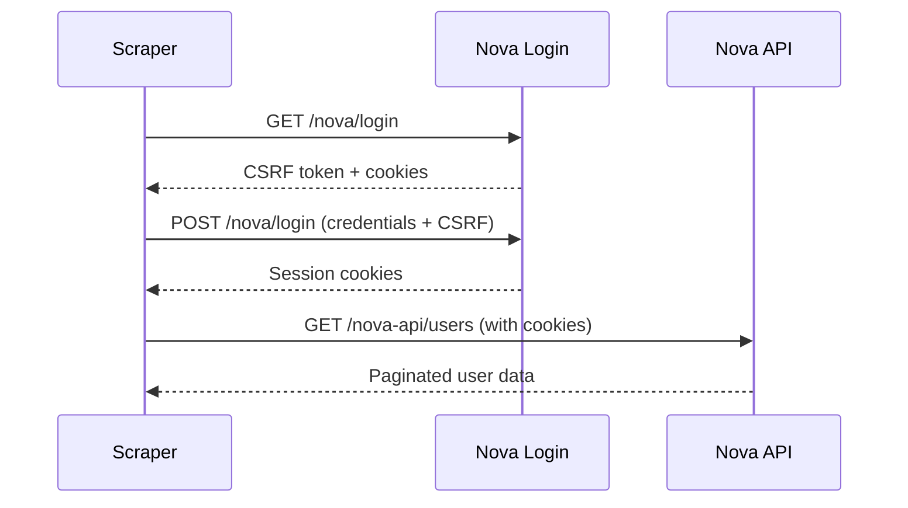

The Volunteer Portal includes a comprehensive migration system for importing users and historical shift data from the legacy Laravel Nova admin system.

## Overview

The migration system was built to transition from the old Laravel Nova-based volunteer management system to the new Next.js volunteer portal. It automates the process of:

- **User Migration**: Import volunteer profiles with all their details
- **Historical Data**: Import past shift signups and attendance records
- **Invitation System**: Send email invitations to migrated users to complete their registration
- **Progress Tracking**: Real-time progress updates during bulk migrations

## System Architecture

The migration system consists of several components:

### Backend Components

- **Laravel Nova Scraper** (`web/src/lib/laravel-nova-scraper.ts`) - Authenticates with the old Laravel Nova system and scrapes user data via the Nova API
- **Historical Data Transformer** (`web/src/lib/historical-data-transformer.ts`) - Transforms Laravel Nova data format to the new database schema
- **Migration API Routes** (`web/src/app/api/admin/migration/*`) - RESTful endpoints for migration operations
- **SSE Progress Tracking** (`web/src/lib/sse-utils.ts`) - Server-Sent Events for real-time migration progress

### Frontend Components

- **Admin Migration UI** (`web/src/app/admin/migration/`) - Administrative interface for managing migrations
- **Nova Bulk Migration** - Main interface for bulk user imports
- **Historical Data Selector** - Tool for selecting which historical data to import
- **User Invitations** - Interface for sending invitation emails to migrated users
- **Migration Status** - Dashboard showing migration progress and statistics

## Laravel Nova Authentication

The scraper authenticates with the legacy Laravel Nova system using web scraping techniques:

### Authentication Flow



### Configuration

To connect to Laravel Nova, provide these credentials:

```typescript
const novaConfig = {
  baseUrl: "https://your-nova-instance.com",  // Laravel Nova URL
  email: "admin@example.com",                 // Admin email
  password: "admin-password"                  // Admin password
};
```

**Security Note**: These credentials are only used during migration and are never stored. They're sent directly from the admin UI to the migration API.

## User Migration Process

### Step 1: Authentication

The scraper logs into Laravel Nova using provided admin credentials:

1. Fetches the login page to get CSRF token and session cookies
2. Submits login form with credentials and CSRF token
3. Stores session cookies for subsequent API requests

### Step 2: User Discovery

The scraper fetches users from Laravel Nova's API:

```typescript
// Nova API endpoint
GET /nova-api/users?page=1&perPage=50

// Response includes user resources with fields
{
  "resources": [
    {
      "id": { "value": 123 },
      "fields": [
        { "attribute": "email", "value": "volunteer@example.com" },
        { "attribute": "name", "value": "John Doe" },
        { "attribute": "phone", "value": "+64 21 123 4567" },
        // ... more fields
      ]
    }
  ]
}
```

### Step 3: Data Transformation

User data is transformed from Nova format to Prisma schema:

**Nova User Fields → Database Schema:**

- `email` → `user.email`
- `name` → parsed into `firstName` and `lastName`
- `phone` → `user.phone`
- `date_of_birth` → `user.dateOfBirth`
- `emergency_contact_*` → `user.emergencyContact*`
- `dietary_requirements` → `user.dietaryRequirements`
- `medical_info` → `user.medicalInfo`

### Step 4: User Creation

Users are created in the database with:

```typescript
await prisma.user.create({
  data: {
    email: userData.email,
    firstName: userData.firstName,
    lastName: userData.lastName,
    phone: userData.phone,
    dateOfBirth: userData.dateOfBirth,
    // ... other fields
    role: "VOLUNTEER",
    migrationData: {
      create: {
        legacyId: novaUser.id,
        legacySystem: "nova",
        migratedAt: new Date(),
        migratedBy: adminUserId,
        invitationSent: false,
      },
    },
  },
});
```

### Step 5: Invitation Email

After migration, invitation emails are sent to users:

```typescript
await emailService.sendUserInvitation({
  to: user.email,
  firstName: user.firstName,
  invitationUrl: `${baseUrl}/register?token=${invitationToken}`,
  organizationName: "Everybody Eats",
});
```

## Historical Data Migration

The system can optionally import historical shift signup and attendance data.

### Data Types Imported

1. **Shift Signups**: Past volunteer shift registrations
2. **Attendance Records**: Whether volunteers showed up for shifts
3. **Event Associations**: Links between users and events

### Historical Data Transformation

```typescript
// Nova shift signup → Database signup
{
  signup: {
    userId: mappedUserId,
    shiftId: mappedShiftId,
    status: novaSignup.status,
    createdAt: novaSignup.created_at,
    attended: novaSignup.attended,
  }
}
```

### Import Filters

Historical data can be filtered by:

- **Date Range**: Only import signups within a specific time period
- **Event Type**: Filter by specific shift types
- **Status**: Include/exclude specific signup statuses
- **Attendance**: Only import attended shifts

## Admin Migration UI

### Accessing the Migration Interface

1. Navigate to `/admin/migration` (Admin role required)
2. The interface has multiple tabs:
   - **Bulk Migration**: Import users from Laravel Nova
   - **Historical Data**: Import past shift data
   - **User Invitations**: Send invitations to migrated users
   - **Migration Status**: View migration statistics

### Bulk Migration Interface

**Features:**

- **Nova Connection Test**: Verify credentials before migration
- **User Preview**: See list of users to be imported
- **Migration Options**:
  - Skip existing users
  - Include historical data
  - Batch size configuration
  - Dry run mode (test without importing)
  - Start page (resume from specific page)

**Usage:**

1. Enter Laravel Nova credentials
2. Click "Test Connection" to verify access
3. Configure migration options
4. Click "Preview Migration" to see what will be imported
5. Click "Start Migration" to begin the import
6. Monitor real-time progress via progress bar

### Real-Time Progress Updates

The migration uses Server-Sent Events (SSE) for live progress:

```typescript
// Progress events include:
{
  type: "user_migrated",
  message: "Migrated user: john@example.com",
  usersProcessed: 45,
  totalUsers: 150,
  progress: 30
}
```

Progress includes:
- Current user being processed
- Number of users processed
- Total users to migrate
- Percentage complete
- Errors encountered

## API Endpoints

### Migration Endpoints

| Endpoint | Method | Description |
|----------|--------|-------------|
| `/api/admin/migration/test-nova-connection` | POST | Test Laravel Nova credentials |
| `/api/admin/migration/preview-nova-migration` | POST | Preview users to be migrated |
| `/api/admin/migration/bulk-nova-migration` | POST | Execute bulk user migration |
| `/api/admin/migration/scrape-user-history` | POST | Scrape historical data for a user |
| `/api/admin/migration/batch-import-history` | POST | Bulk import historical data |
| `/api/admin/migration/send-invitations` | POST | Send invitation emails |
| `/api/admin/migration/resend-invitation` | POST | Resend invitation to specific user |
| `/api/admin/migration/stats` | GET | Get migration statistics |
| `/api/admin/migration/migrated-data` | GET | List migrated users |
| `/api/admin/migration/progress-stream` | GET | SSE endpoint for progress |

### Example: Testing Nova Connection

```typescript
const response = await fetch('/api/admin/migration/test-nova-connection', {
  method: 'POST',
  headers: { 'Content-Type': 'application/json' },
  body: JSON.stringify({
    novaConfig: {
      baseUrl: "https://nova.example.com",
      email: "admin@example.com",
      password: "password"
    }
  })
});

const result = await response.json();
// { success: true, message: "Connection successful" }
```

### Example: Bulk Migration

```typescript
const response = await fetch('/api/admin/migration/bulk-nova-migration', {
  method: 'POST',
  headers: { 'Content-Type': 'application/json' },
  body: JSON.stringify({
    novaConfig: {
      baseUrl: "https://nova.example.com",
      email: "admin@example.com",
      password: "password"
    },
    options: {
      skipExistingUsers: true,
      includeHistoricalData: true,
      batchSize: 50,
      dryRun: false,
      startPage: 1
    },
    sessionId: "unique-session-id-for-progress-tracking"
  })
});
```

## Migration Options

### skipExistingUsers

**Type**: `boolean`
**Default**: `true`

Skip users that already exist in the database (matched by email).

```typescript
skipExistingUsers: true  // Don't re-import existing users
```

### includeHistoricalData

**Type**: `boolean`
**Default**: `true`

Import historical shift signup and attendance data along with user profiles.

```typescript
includeHistoricalData: true  // Import past shift data
```

### batchSize

**Type**: `number`
**Default**: `50`

Number of users to process per batch. Larger batches are faster but use more memory.

```typescript
batchSize: 50  // Process 50 users at a time
```

### dryRun

**Type**: `boolean`
**Default**: `false`

Test the migration without actually creating database records.

```typescript
dryRun: true  // Preview only, don't create records
```

### startPage

**Type**: `number`
**Default**: `1`

Start migration from a specific page (useful for resuming interrupted migrations).

```typescript
startPage: 5  // Resume from page 5
```

## Migration Data Tracking

Every migrated user has associated migration metadata:

```prisma
model MigrationData {
  id             String   @id @default(cuid())
  userId         String   @unique
  user           User     @relation(fields: [userId], references: [id])

  legacyId       Int      // Original Nova user ID
  legacySystem   String   // "nova"
  migratedAt     DateTime
  migratedBy     String   // Admin user ID

  invitationSent Boolean  @default(false)
  invitationToken String?
  invitedAt      DateTime?
  registeredAt   DateTime?
}
```

This allows tracking:
- Which users were migrated
- When they were migrated
- Who performed the migration
- Invitation status
- Registration completion

## Monitoring and Troubleshooting

### Migration Statistics

View migration stats via the API:

```typescript
GET /api/admin/migration/stats

{
  totalMigrated: 250,
  invitationsSent: 200,
  registrationsComplete: 150,
  pendingInvitations: 50,
  lastMigrationDate: "2024-01-15T10:30:00Z"
}
```

### Common Issues

**Authentication Fails**
- Verify Laravel Nova credentials are correct
- Ensure admin account has access to Nova
- Check that Nova URL is correct and accessible

**Users Not Found**
- Verify Nova API is accessible at `/nova-api/users`
- Check pagination settings
- Ensure users exist in Nova database

**Historical Data Import Fails**
- Verify shift types exist in new system
- Check date formats are compatible
- Ensure event IDs can be mapped

**Invitation Emails Not Sending**
- Verify Campaign Monitor is configured
- Check email template ID is correct
- Review email service logs

### Progress Monitoring

Monitor migration progress in real-time:

1. Open browser dev tools → Network tab
2. Look for SSE connection to `/api/admin/migration/progress-stream`
3. Watch progress events stream in
4. Check for error events

### Logs

Server logs include detailed migration information:

```
[MIGRATION] Starting bulk migration for 150 users
[MIGRATION] Page 1/3: Processing 50 users
[MIGRATION] Migrated user: john@example.com (ID: 123)
[MIGRATION] Page 1/3 complete: 50 users migrated
[MIGRATION] Migration complete: 150 users in 45 seconds
```

## Security Considerations

1. **Admin-Only Access**: Migration endpoints require ADMIN role
2. **Credentials Not Stored**: Laravel Nova credentials are never persisted
3. **Bot Protection**: Rate limiting prevents automated abuse
4. **Invitation Tokens**: Secure random tokens for user registration
5. **Audit Trail**: All migrations are logged with admin user ID

## Best Practices

1. **Test Connection First**: Always verify credentials before starting migration
2. **Use Dry Run**: Test migration with `dryRun: true` first
3. **Start Small**: Begin with a small batch size to test
4. **Monitor Progress**: Watch the progress stream for errors
5. **Backup Database**: Create a backup before large migrations
6. **Schedule Off-Peak**: Run large migrations during low-traffic periods
7. **Verify Data**: Check migrated data quality before sending invitations

## Related Documentation

- [Email Systems](/developers/email-systems) - User invitation email configuration
- [Developer Access Guide](/developers/developer-access-guide) - Getting admin access
- [Admin User Management](/admin-user-management) - Managing migrated users
