This guide explains how to get access to all the development tools, services, and systems needed to work on the Volunteer Portal, including hosting platforms, databases, email services, and monitoring tools.

## Overview

Working on the Volunteer Portal requires access to various third-party services and development tools. This guide covers:

- Repository and version control access
- Hosting platform access (Vercel)
- Database access (Supabase)
- DNS management (Cloudflare)
- Email service access (Campaign Monitor)
- Analytics platform (PostHog)
- CMS and website management (Webflow)
- Payment processing (Stripe)
- Automation platform (Zapier)
- Monitoring and analytics tools
- Development environment setup

## System Architecture

The following diagram shows how the various services connect together:

```mermaid
graph TB
    %% Core Application
    Portal[🌐 Volunteer Portal]

    %% Development & Hosting
    GitHub[📦 GitHub Repository]
    Vercel[☁️ Vercel Hosting]
    Cloudflare[🌐 Cloudflare DNS]

    %% Data & Analytics
    Supabase[(🗄️ Supabase Database)]
    PostHog[📊 PostHog Analytics]

    %% Content & Payments
    Webflow[🎨 Webflow CMS]
    Stripe[💳 Stripe Payments]

    %% Automation & Communications
    Zapier[🔗 Zapier Automations]
    CampaignMonitor[📧 Campaign Monitor]

    %% Connections
    Portal --> Supabase
    Portal --> PostHog
    Portal --> CampaignMonitor

    GitHub --> Vercel
    Cloudflare --> Vercel
    Vercel --> Portal

    Webflow --> Stripe
    Webflow --> PostHog
    Stripe --> Zapier
    Zapier --> CampaignMonitor

    Webflow --> Portal

    %% Styling
    classDef primary fill:#3b82f6,stroke:#1e40af,stroke-width:2px,color:#fff
    classDef secondary fill:#10b981,stroke:#047857,stroke-width:2px,color:#fff
    classDef external fill:#f59e0b,stroke:#d97706,stroke-width:2px,color:#fff

    class Portal primary
    class GitHub,Vercel,Supabase,Cloudflare secondary
    class Webflow,Stripe,Zapier,CampaignMonitor,PostHog external
```



**Key Integration Points:**

- **Cloudflare → Vercel → Portal**: DNS management routes traffic to Vercel hosting platform
- **Webflow → Stripe → Zapier → Campaign Monitor**: Payment processing on main website triggers automated email workflows
- **Webflow → Portal**: Main website links to volunteer portal application
- **Both → PostHog**: User behavior and feature flag analytics from both CMS and Portal
- **Portal → Supabase**: All application data storage
- **Portal → Campaign Monitor**: Direct email sending from volunteer portal
- **GitHub → Vercel**: Automated deployments

## Getting Started

### Request Access via Email

Send the following email to the general manager to request all necessary system access:

```
Subject: Everybody Eats Platform Access Request - [Your Name]

Hi [General Manager Name],

I'm requesting access to the development systems for Everybody Eats. Please see my details and access requirements below:

Personal Information:
- Name: [Your Full Name]
- Email: [your.email@organization.com]
- GitHub Username: [your-github-username]
- Role: [Developer/Tester/DevOps Engineer]

Access Requested:
Based on my role, I need access to the following systems:

Essential Systems:
- [ ] GitHub repository (volunteer-portal) - https://github.com/everybody-eats-nz/volunteer-portal
- [ ] Vercel hosting platform (production and demo environments) - https://vercel.com/everybody-eats
- [ ] Supabase database access - https://app.supabase.com/
- [ ] Cloudflare DNS management - https://dash.cloudflare.com/
- [ ] Campaign Monitor email service - https://app.campaignmonitor.com/
- [ ] PostHog analytics platform - https://app.posthog.com/

Additional Systems (if applicable to role):
- [ ] Webflow CMS (main website) - https://webflow.com/dashboard
- [ ] Stripe payment processing - https://dashboard.stripe.com/
- [ ] Zapier automations - https://zapier.com/app/dashboard

Please let me know if you need any additional information or if there's a specific onboarding process I should follow.

Thank you!

Best regards,
[Your Name]
```

## System Access Requirements

### GitHub Repository Access

**What you'll get:**

- Read/write access to the volunteer portal repository
- Ability to create branches and pull requests
- Access to issues and project boards

**Setup Steps:**

1. Ensure you have a GitHub account at [github.com](https://github.com)
2. Request access from repository administrator
3. Accept the organization invitation
4. Clone the repository locally from [github.com/everybody-eats-nz/volunteer-portal](https://github.com/everybody-eats-nz/volunteer-portal)

### Vercel Hosting Platform

**What you'll need access to:**

- Vercel organization: "Everybody Eats"
- Projects: Volunteer Portal (production and demo environments)
- Deployment logs and analytics
- Environment variable management

**Setup Steps:**

1. Create a Vercel account at [vercel.com](https://vercel.com)
2. Request invitation to the organization at [vercel.com/everybody-eats](https://vercel.com/everybody-eats)
3. Accept the team invitation
4. Connect your GitHub account for deployments

**Access Levels:**

- **Developer**: Deploy previews, view logs
- **Admin**: Manage environment variables, production deployments

### Supabase Database Access

**What you'll need access to:**

- Supabase organization: "Everybody Eats"
- Database projects: Production and demo instances
- SQL editor and table browser
- API keys for development

**Setup Steps:**

1. Create a Supabase account at [supabase.com](https://supabase.com)
2. Request invitation to the organization at [app.supabase.com](https://app.supabase.com)
3. Get database connection strings for local development
4. Set up local environment variables

**Access Levels:**

- **Read-only**: View data and run SELECT queries
- **Developer**: Full database access except production writes
- **Admin**: Full access including production database

### Cloudflare DNS Management

**What you'll need access to:**

- Cloudflare account for `everybodyeats.nz` domain
- DNS record management
- Security settings and SSL/TLS configuration
- Analytics and performance monitoring
- Page rules and firewall settings

**Setup Steps:**

1. Create a Cloudflare account at [cloudflare.com](https://cloudflare.com) if needed
2. Request invitation to the Everybody Eats organization
3. Accept the team invitation email
4. Log in to [dash.cloudflare.com](https://dash.cloudflare.com)
5. Access the `everybodyeats.nz` domain

**Access Levels:**

- **Read-only**: View DNS records and analytics
- **DNS Manager**: Edit DNS records, view settings
- **Admin**: Full access including security settings and billing

**Important Notes:**

- DNS changes affect production immediately - always verify before saving
- Current DNS records:
  - `volunteers.everybodyeats.nz` → Vercel production
- Demo/preview environments use Vercel's automatic URLs (e.g., `demo.everybody-eats.vercel.app`)
- DNS is configured in "DNS-only" mode (no proxy) to allow Vercel's CDN
- Changes to DNS records may take up to 48 hours to propagate globally

### Campaign Monitor Email Service

**What you'll need access to:**

- Campaign Monitor organization account
- Email template management
- Analytics and delivery reporting
- API credentials

**Setup Steps:**

1. Request access from organization administrator
2. Create account at [campaignmonitor.com](https://www.campaignmonitor.com) if needed
3. Log in to [app.campaignmonitor.com](https://app.campaignmonitor.com)
4. Get API key from Account Settings
5. Note template IDs for development configuration

**Access Levels:**

- **Viewer**: Read-only access to templates and reports
- **User**: Create and edit templates, view analytics
- **Administrator**: Full access including billing and user management

### PostHog Analytics Platform

**What you'll need access to:**

- PostHog organization for Everybody Eats
- Analytics dashboards and insights
- Feature flag management
- Event tracking and user behavior data
- A/B testing capabilities

**Setup Steps:**

1. Request access from general manager
2. Create account at [posthog.com](https://posthog.com) if needed
3. Log in to [app.posthog.com](https://app.posthog.com)
4. Get API key for development environment
5. Configure PostHog project key for local development

**Access Levels:**

- **Viewer**: View analytics dashboards and insights
- **Developer**: Create feature flags, view detailed analytics
- **Administrator**: Full access including project settings and billing

### Webflow CMS (Main Website)

**What you'll need access to:**

- Webflow workspace for Everybody Eats
- Main website design and content management
- Publishing capabilities
- CMS content editing

**Setup Steps:**

1. Request access from general manager
2. Create account at [webflow.com](https://webflow.com) if needed
3. Log in to [webflow.com/dashboard](https://webflow.com/dashboard)
4. Access the Everybody Eats workspace
5. Familiarize yourself with the site structure

**Access Levels:**

- **Editor**: Edit content and CMS items
- **Designer**: Full design and layout editing capabilities
- **Admin**: Workspace management and billing access

**Note:** Webflow is primarily used for the main marketing website, not the volunteer portal application.

### Stripe Payment Processing

**What you'll need access to:**

- Stripe account for Everybody Eats
- Payment dashboard and analytics
- Webhook configuration
- API keys for development and production
- Transaction monitoring and reporting

**Setup Steps:**

1. Request access from general manager
2. Create account at [stripe.com](https://stripe.com) if needed
3. Log in to [dashboard.stripe.com](https://dashboard.stripe.com)
4. Get API keys for development environment
5. Configure webhook endpoints for local testing

**Access Levels:**

- **Read-only**: View transactions and basic analytics
- **Developer**: Access to API keys, webhook configuration
- **Administrator**: Full access including account settings and billing

### Zapier Automations

**What you'll need access to:**

- Zapier account for Everybody Eats
- Existing automation workflows (Zaps)
- Integration management
- Workflow monitoring and debugging

**Setup Steps:**

1. Request access from general manager
2. Create account at [zapier.com](https://zapier.com) if needed
3. Log in to [zapier.com/app/dashboard](https://zapier.com/app/dashboard)
4. Review existing automation workflows
5. Understand trigger and action configurations

**Access Levels:**

- **Viewer**: View existing Zaps and their performance
- **Editor**: Create and modify automation workflows
- **Administrator**: Full account management and billing access

**Note:** Zapier connects various services together for automated workflows, such as syncing data between platforms.

## Access Requirements by Role

| Service              | Developer      | Tester       | DevOps Engineer |
| -------------------- | -------------- | ------------ | --------------- |
| **GitHub**           | ✅ Read/Write  | 👁️ Read-only | 🔑 Admin        |
| **Vercel**           | 🛠️ Developer   | 👁️ Viewer    | 🔑 Admin        |
| **Supabase**         | 🛠️ Developer   | 👁️ Read-only | 🔑 Admin        |
| **Cloudflare**       | 👁️ Read-only   | ❌ Not needed | 🔑 Admin        |
| **Campaign Monitor** | ✅ User        | 👁️ Viewer    | 🔑 Admin        |
| **PostHog**          | 🛠️ Developer   | 👁️ Viewer    | 🔑 Admin        |
| **Webflow CMS**      | ✏️ Editor      | 👁️ Viewer    | 🔑 Admin        |
| **Stripe**           | 🛠️ Developer   | 👁️ Viewer    | 🔑 Admin        |
| **Zapier**           | 👁️ Viewer      | 👁️ Viewer    | 🔑 Admin        |

## Related Documentation

- [Technology Stack](/developers/tech-stack) - Overview of all technologies used
- [Hosting & Infrastructure](/developers/hosting-infrastructure) - Detailed hosting setup
- [Email Systems](/developers/email-systems) - Email implementation details
- [Authentication & Authorization](/developers/authentication-authorization) - Auth system setup
