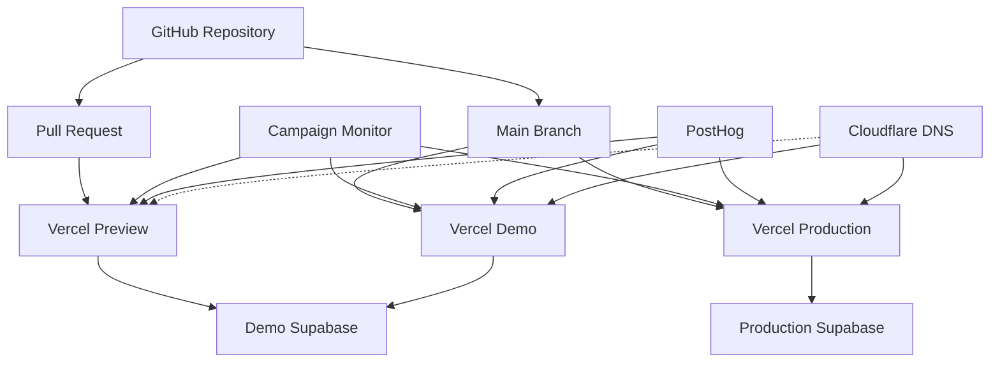
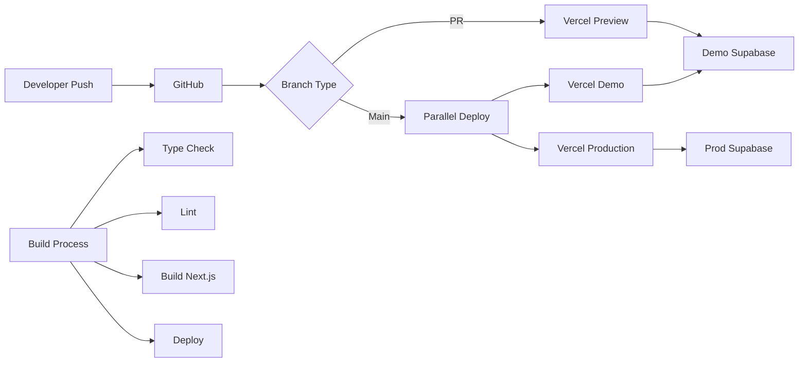

The Everybody Eats Volunteer Portal is deployed using a modern cloud infrastructure stack with separate environments for development and production.

## Hosting Providers

### Vercel - Application Hosting

**[Vercel](https://vercel.com/)** hosts the Next.js application

- **Organization**: Everybody Eats organization on Vercel
- **Projects**:
  - **Volunteer Portal**:
    - Environments:
      - `Production` Live production environment
      - `demo` Staging environment for testing
- **Why Vercel**: Optimized for Next.js, automatic deployments, edge functions, and excellent DX
- **Features Used**:
  - Automatic deployments from GitHub branches
  - Preview deployments for pull requests
  - Edge proxy middleware for performance
  - Environment variable management
  - Analytics and Web Vitals monitoring
  - Automatic SSL certificates
  - Global CDN distribution

### Supabase - Database & Backend Services

**[Supabase](https://supabase.com/)** provides PostgreSQL database and backend services

- **Organization**: Everybody Eats organization on Supabase
- **Projects**:
  - **Production Database**: `volunteer-portal-prod` - Production PostgreSQL instance
  - **Demo Database**: `volunteer-portal-demo` - Staging database for testing
- **Why Supabase**: Managed PostgreSQL, automatic backups, connection pooling, and excellent performance
- **Features Used**:
  - PostgreSQL 15+ database
  - Connection pooling for Prisma
  - Automatic daily backups
  - Point-in-time recovery
  - Row Level Security (RLS) ready
  - Database monitoring and metrics
  - SQL editor for maintenance

### Cloudflare - DNS Management

**[Cloudflare](https://cloudflare.com/)** manages DNS for the `everybodyeats.nz` domain

- **Domain**: `everybodyeats.nz`
- **DNS Records**:
  - `volunteers.everybodyeats.nz` → Vercel production deployment
- **Why Cloudflare**: Fast global DNS resolution, excellent security features, and reliable uptime
- **Features Used**:
  - Global DNS with low latency
  - DNSSEC for enhanced security
  - DDoS protection
  - DNS analytics and monitoring
  - Free SSL/TLS certificate support
  - Automatic failover capabilities
- **Configuration**: DNS-only mode (orange cloud disabled) to allow Vercel's CDN and SSL management

**Note**: Demo/preview environments use Vercel's automatic URLs (e.g., `demo.everybody-eats.vercel.app`) and do not require custom DNS records.

## Third-Party Services

### Campaign Monitor - Email Services

**[Campaign Monitor](https://www.campaignmonitor.com/)** handles transactional and marketing emails

- **Organization Account**: Everybody Eats
- **Email Types**:
  - Transactional emails (shift confirmations, reminders)
  - Group booking invitations
  - User invitation emails
  - Email verification
- **Integration**: API integration for automated emails
- **Templates**: Custom HTML templates matching brand design
- **Analytics**: Open rates, click tracking, and engagement metrics

### PostHog - Analytics & Product Intelligence

**[PostHog](https://posthog.com/)** provides product analytics and user insights

- **Organization**: Everybody Eats workspace
- **Projects**: Volunteer Portal
- **Features Used**:
  - User behavior tracking
  - Feature usage analytics
  - Conversion funnel analysis
  - Session recordings (opt-in only)
  - A/B testing capabilities
  - Custom event tracking
- **Privacy**: GDPR compliant with user consent management
- **Integration**: Client-side SDK in Next.js application

## Environment Configuration

### Environment Structure



### Environment Variables

**Production Environment** (`Production` environment on Vercel)

```env
DATABASE_URL=postgresql://[connection-string]  # Supabase production
NEXTAUTH_URL=https://volunteers.everybodyeats.nz
NEXTAUTH_SECRET=[generated-secret]

# OAuth Providers (Production)
GOOGLE_CLIENT_ID=[prod-google-id]
GOOGLE_CLIENT_SECRET=[prod-google-secret]
FACEBOOK_CLIENT_ID=[prod-facebook-id]
FACEBOOK_CLIENT_SECRET=[prod-facebook-secret]
APPLE_CLIENT_ID=[prod-apple-id]
APPLE_CLIENT_SECRET=[prod-apple-secret]

# Third-Party Services
CAMPAIGN_MONITOR_API_KEY=[prod-api-key]
CAMPAIGN_MONITOR_LIST_ID=[prod-list-id]
POSTHOG_KEY=[prod-posthog-key]
POSTHOG_HOST=https://app.posthog.com
```

**Demo/Staging Environment** (`demo` environment on Vercel)

```env
DATABASE_URL=postgresql://[connection-string]  # Supabase demo
NEXTAUTH_URL=https://demo.everybody-eats.vercel.app
NEXTAUTH_SECRET=[generated-secret]

# OAuth Providers (Demo)
GOOGLE_CLIENT_ID=[demo-google-id]
GOOGLE_CLIENT_SECRET=[demo-google-secret]
# ... other OAuth providers

# Third-Party Services (Demo keys)
CAMPAIGN_MONITOR_API_KEY=[demo-api-key]
CAMPAIGN_MONITOR_LIST_ID=[demo-list-id]
POSTHOG_KEY=[demo-posthog-key]
POSTHOG_HOST=https://app.posthog.com
```

## Deployment Pipeline

### Continuous Deployment

**GitHub → Vercel Integration**

1. **Pull Requests**: Automatic preview deployments on Vercel
2. **Main Branch**: Automatic production deployment
3. **Feature Branches**: Optional preview deployments

### Deployment Process



### Database Migrations

**Production Migrations**

```bash
# Deploy migrations
npm run prisma:deploy

# Verify migration
npm run prisma:studio
```

**Rollback Strategy**

- Supabase point-in-time recovery for data issues
- Prisma migration history for schema rollbacks
- Automated backups before major migrations

## Monitoring & Observability

### Application Monitoring

**Vercel Analytics**

- Real-time performance metrics
- Web Vitals tracking
- Error tracking
- Function execution monitoring

**PostHog Monitoring**

- User journey tracking
- Feature adoption metrics
- Error event tracking
- Performance monitoring

### Database Monitoring

**Supabase Dashboard**

- Query performance metrics
- Connection pool monitoring
- Storage usage tracking
- Automatic alerting for issues

### Email Monitoring

**Campaign Monitor Reports**

- Delivery rates
- Open and click rates
- Bounce handling
- Unsubscribe management

## Security Configuration

### SSL/TLS Certificates

- **Vercel**: Automatic SSL provisioning and renewal
- **Custom Domains**: Automatic certificate management
- **Forced HTTPS**: Automatic redirect from HTTP to HTTPS

### Database Security

**Supabase Security Features**

- SSL connections enforced
- Connection pooling with PgBouncer
- IP allowlisting available
- Encrypted backups
- Row Level Security (RLS) ready

### API Security

**Rate Limiting**

- Vercel Edge Proxy Middleware for rate limiting
- DDoS protection at edge locations
- API route protection

### Secret Management

**Vercel Environment Variables**

- Encrypted at rest
- Scoped by environment (preview/production)
- Audit logging for changes
- Team-based access control

## Scaling Configuration

### Application Scaling

**Vercel Scaling**

- Automatic horizontal scaling
- Edge function distribution
- Global CDN for static assets
- Serverless function concurrency

### Database Scaling

**Supabase Scaling Options**

- Vertical scaling (upgrade instance size)
- Connection pooling optimization
- Read replicas (if needed)
- Automatic resource scaling

## Backup & Recovery

### Database Backups

**Supabase Backup Policy**

- **Daily Backups**: Automatic daily snapshots
- **Retention**: 7-30 days based on plan
- **Point-in-Time Recovery**: Available for production
- **Manual Backups**: On-demand backup creation

### Code Backups

**GitHub Repository**

- Full version history
- Branch protection rules
- Tag releases for deployments

## Cost Management

### Service Tiers

**Vercel**

- Pro plan for production
- Includes team seats
- Analytics and monitoring
- Priority support

**Supabase**

- Pro plan for production database
- Free tier for demo/staging
- Pay-as-you-go for storage/bandwidth

**Campaign Monitor**

- Pay per email volume
- Template storage included

**PostHog**

- Free tier for basic analytics
- Usage-based pricing for events

## Disaster Recovery Plan

### Recovery Time Objectives (RTO)

- **Application**: < 5 minutes (Vercel automatic failover)
- **Database**: < 1 hour (Supabase backup restoration)
- **Full Recovery**: < 2 hours

### Recovery Point Objectives (RPO)

- **Database**: < 24 hours (daily backups)
- **Code**: Zero data loss (Git repository)

## Support & Resources

### Documentation

- **Vercel**: [docs.vercel.com](https://docs.vercel.com)
- **Supabase**: [supabase.com/docs](https://supabase.com/docs)
- **Campaign Monitor**: [help.campaignmonitor.com](https://help.campaignmonitor.com)
- **PostHog**: [posthog.com/docs](https://posthog.com/docs)

### Support Channels

- **Vercel**: [Pro support via dashboard](https://vercel.com/support)
- **Supabase**: [Pro support tickets](https://supabase.com/support)
- **Campaign Monitor**: [Email support](https://www.campaignmonitor.com/support/)
- **PostHog**: [Community support](https://posthog.com/questions) | [Paid support](https://posthog.com/pricing)
